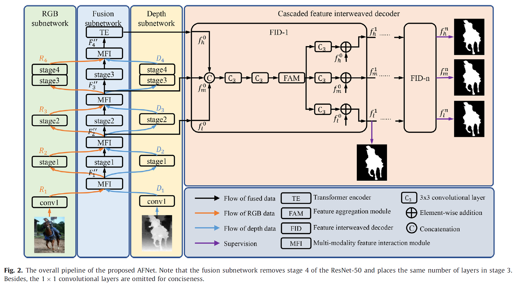

# AFNet
# [Adaptive fusion network for RGB-D salient object detection](https://doi.org/10.1016/j.neucom.2022.12.004)

This repo. is an official implementation of the *AFNet* , which has been accepted in the journal *Neurocomputing, 2023*. 

The main pipeline is shown as the following, 


And some results are presented


## Dependencies 
```
>= Pytorch 1.0.0
OpenCV-Python
[optional] matlab
```

## Datasets
Training and testing datasets are available at 

([Baidu](https://pan.baidu.com/s/1FfUyjr_rUo4ek8pp0DzvDw)) [code:jyb2]

## Training
```
python train.py
```

## Test
```
 python test.py
```
We provide the trained model file ([Baidu](https://pan.baidu.com/s/1j5pGbXzQ1Jpp_1-FJi6UvA)) [code:r7wc] ([Google](https://drive.google.com/file/d/1ZLhYKFrke1paKryssQJTmcvs9WPEfQGU/view?usp=share_link))

The prediction results are also available ([Baidu](https://pan.baidu.com/s/1WoY4dNgqOL3O4Sa9TXa3VQ)). [code:ijj9]


## Citation
Please cite the `AFNet` in your publications if it helps your research:
```
@article{CHEN2022,
  title = {Adaptive fusion network for RGB-D salient object detection},
  author = {Tianyou Chen and Jin Xiao and Xiaoguang Hu and Guofeng Zhang and Shaojie Wang},
  journal = {Neurocomputing},
  year = {2023},
}
```
## Reference
[BBSNet](https://github.com/zyjwuyan/BBS-Net)
